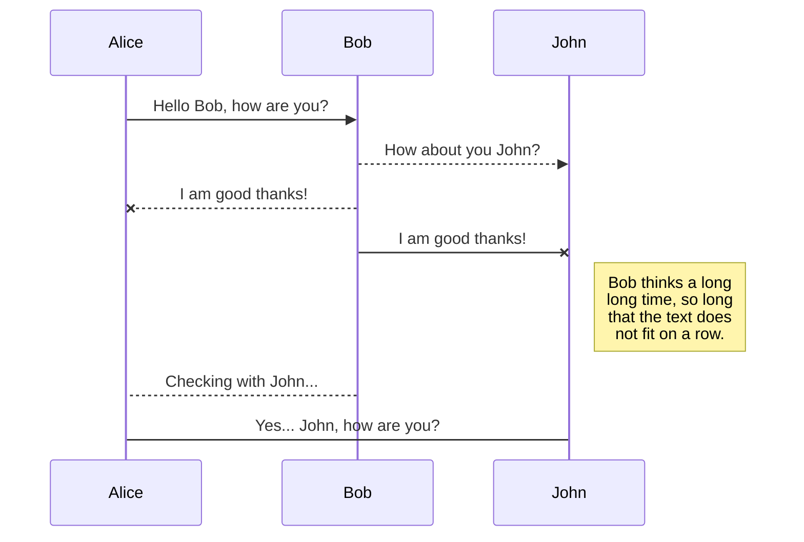
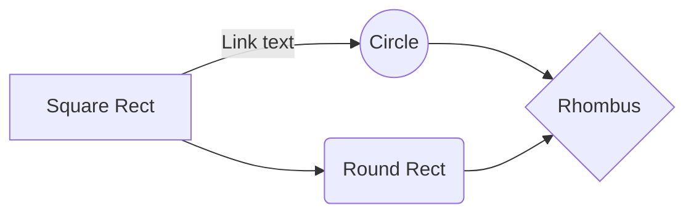

# **ESP8266 Simple Testing with examples in Micropython**

I was digging on internet for some examples about testing on ESP8266 in Micropython just for myself education purpose and I didn't find too much useful examples for me. So I decided to fill this gap and I hope this can be  also useful for others who are willing to deal with the topic or teach their students about basics and how to automate testing. Why ESP8266 ? Because it is cost-effective and highly integrated Wi-Fi MCU for IoT / smart things... applications


## **Back to Testing..**

You can find lot of great articles about this topic explaining why it is worth spend so much time with Testing or why TDD make sense and so on. Usually my first and simple answer why is ist just because we want to suppress future costs of fixing bugs in production. Real nightmare of each developer doing coding for living should be spending hours of life time in finding bugs in code done by someone else running production with help of neurotic manager who is keeping him or her in pace..  
 
Some summary from my small internet research is bellow and it is about what could be considered and make sense in our case if we develop IoT application with ESP8266 and Micropython

### **Best practices for effective IoT Testing**

- Gray Box testing as it allows to design effective test case
- Gray Box allows you to know the OS, the architecture, third-party hardware, new connectivity and hardware device limitation.
- Real Time Operating System
- IoT Testing should be automated


### **Challenges of IOT Testing**
- Network and internal communication
- Security
- The system complexity & bugs present in the IOT technology
- Limitations in memory, processing power, bandwidth, battery life, etc.

<br/>
# Things used in this project

### **Hardware components**

 Things used in this project

### **Hardware components**

||Name|Qt||
| :---|:------------------------:|:---| ----:|
| Img | Raspberry Pi 3 Model B	 | ×1 | link |
| Img | Raspberry Pi 3 Model B	 | ×1 | link |
| Img | Raspberry Pi 3 Model B	 | ×1 | link |
| Img | Raspberry Pi 3 Model B	 | ×1 | link |
| Img | Raspberry Pi 3 Model B	 | ×1 | link |

### **Software apps and online services**
||Name|Qt||
| :---|:------------------------:|:---| ----:|
| Img | Raspberry Pi 3 Model B	 | ×1 | link |

### **Hand tools and fabrication machines**
||Name|Qt||
| :---|:------------------------:|:---| ----:|
| Img | Raspberry Pi 3 Model B	 | ×1 | link |

<br/>

# Long story short

Why Did We Build This?
Idea 💡
Hardware Build


## **Getting Started with first level - Unit Tests are just functions**


- **Unit tests** are typically made of three pieces, some **setup**, a number of **assertions**, and some **tear-down**. 

- **Setup** can be as simple as initializing the input values or as complex as creating and initializing concrete instances of a class. 

- **Execution**, the test occurs when an assertion is made, comparing the observed and expected values. For example, let us test  that our mean function successfully calculates the known value for a simple list.

Try to copy and paste following code examples into REPL

### Step 1: MicroPython hello _**assert**_ Keyword

The assert keyword is usually used when we debugging or and lets you test if a condition in your code returns *True*, if not, the program will raise an *AssertionError*.
You can also add a message to be written if the code returns False, check the examples below.

```python
x = "hello Micropython"
    
#if condition returns True, then nothing happens:
assert x == "hello Micropython"
    
#if condition returns False, AssertionError is raised:
assert x == "bye"
```
### Step 2:  Add message

Write a message if the condition is False

```python
x = "hello Micropython"

#if condition returns False, AssertionError is raised:

assert x == "bye", "x should be 'hello Micropython'"
```
### Step 3: Handle exceptions with  _**try**_ / _**except**_ / _**finally**_ block

In example the try block raises an *AssertionError* and the except block will be executed. Without the try block, program will crash and raise an error

```python
# try/except/finally example

try:
    assert "Hello" == "Hello"
    assert 3 == 2, "Failed"
    print("Test try/except/finally : pass")

except AssertionError as err:
    print("Test try/except/finally Assertion error: {0}".format(err))
except:
    print("An unexpected exception occurred")
finally:
    print("Teardown try/except/finally...")
```

### Step 4:

```python
# Array Test:

test_list1 = [1, 2, 4, 3, 5]
test_list2 = [1, 2, 4, 3, 5]

assert test_list1 == test_list2
print("Array test : pass")
```
### Step 5:

```python
# Tuple Test:

thistuple1 = ("apple", "banana", "cherry")
thistuple2 = ("apple", "banana", "cherry")

assert thistuple1 == thistuple2
print("Tuple test : pass")
```
### Step 6:

```python
# Set test

thisset1 = {"apple", "banana", "cherry"}
thisset2 = {"apple", "banana", "cherry"}

assert thisset1 == thisset2
print("Set test: pass")
```
### Step 7:

```python
# Dictionary test:

thisdict1 = {
    "brand": "Ford",
    "model": "Mustang",
    "year": 1964
}

thisdict2 = {
    "brand": "Ford",
    "model": "Mustang",
    "year": 1964
}

assert thisdict1 == thisdict2
print("Dictionary test: pass")
```

## **Getting Started with first level - Unit Tests are just functions**

```python
# --------------------------------------------------------------------------------------------

# Equivalence Partitioning

age = 18  # entered age

"""
age = 5
age = 17
age = 18
age = 30
age = 59
age = 61

age = -1
age = 0
age = None
"""


assert age >= 18 and age <= 60, "Equivalence Partitioning test Fail: <=17 Invalid, 18-60 valid, >=61 Invalid"
print("Equivalence Partitioning test: pass")
```

```python
# --------------------------------------------------------------------------------------------
# Boundary Value Analysis


def validateAge(age):
    return (age >= 18) and (age <= 60)


def testBVA():
    age_min = 17
    age_max = 60

    min_0 = age_min - 1
    min_1 = age_min + 1
    min_m = age_min + age_max / 2
    max_1 = age_max
    max_2 = age_max + 1

    def inner(age):
        assert validateAge(
            age), "Boundary Value Analysis test Fail: <=17 Invalid, 18-60 valid, >=61 Invalid"

    inner(18)

#    inner(min_0)
#    inner(min_1)
#    inner(min_m)
#    inner(max_1)
#    inner(max_2)

    print("Boundary Value Analysis test: pass")


testBVA()
```

```python
# --------------------------------------------------------------------------------------------
# Decision Table Testing


conditions = ["Printer does not print", "A red light is flashing",
              "Printer is unrecognised"]  # That was 3 conditions

Power_Cable = "Check the power cable"
Printer_Computer_Cable = "Check the printer-computer cable"
Software_Installed = "Ensure printer software is installed"
New_Ink = "Check/replace ink"
Paper_Jam = "Check for paper jam"


rules = [((True,  False, True),  Power_Cable),
         ((True,  True,  True),  Printer_Computer_Cable),
         ((True,  False, True),  Printer_Computer_Cable),
         ((True,  True,  True),  Software_Installed),
         ((True,  False, True),  Software_Installed),
         ((False, True,  True),  Software_Installed),
         ((False, False, True),  Software_Installed),
         ((True,  True,  True),  New_Ink),
         ((True,  True,  False), New_Ink),
         ((False, True,  True),  New_Ink),
         ((False, True,  False), New_Ink),
         ((True,  True,  False), Paper_Jam),
         ((True,  False, False), Paper_Jam)
         ]

def evalRule(tupl, table):
    answ = []
    for key, val in table:
        if key == tupl:
            answ.append(val)
    return answ

def testDTT():
    
    testcond = (False,  True, True)

    print(conditions[0], ' = ' ,testcond[0])
    print(conditions[1], ' = ' ,testcond[1])
    print(conditions[2], ' = ' ,testcond[2])

    answ = evalRule(testcond, rules) 
    print(answ)
    
    assert answ[0] == Software_Installed and answ[1]== New_Ink and len(answ)<3, "Decision Table test Fail: expected answer =" + Power_Cable
    
    print("Decision Table test: pass")

testDTT()
```

```python
# --------------------------------------------------------------------------------------------
# Fibonacci


def fib(n):
    
#    if n is None or type(n) is str or n < 0:
#        return 0
    
    if n == 0 or n == 1:
        return n
    else:
        return fib(n - 1) + fib(n - 2)


try:
    assert fib(0) == 0  # test edge 0
    assert fib(1) == 1   # test edge 1
    assert fib(8) == 21  # test internal point expected 21

    assert fib(-1) == 0, "invalid value -1"  # test invalid value
    assert fib(None) == 0, "invalid value None"  # test null value
    assert fib('a') == 0, "invalid value 'a'"  # test wrong value type


    print("Fibonacci test: pass")

except AssertionError as err:
    print("Fibonacci test Fail: {0}".format(err))
#except:
#    print("Fibonacci test Fail:An unexpected exception occurred")
```


#### Key features


#### Control - Arduino Shield


**Used I/Os of Arduino**


#### Installation of arm - video tutorial


## **Step 2: ..**
## **Step 3: ..**
## **Step 4: Testing the Model**

# Schematics

# Code

# Next steps

# Credits

## UML diagrams

You can render UML diagrams using [Mermaid](https://mermaidjs.github.io/). For example, this will produce a sequence diagram:



And this will produce a flow chart:

